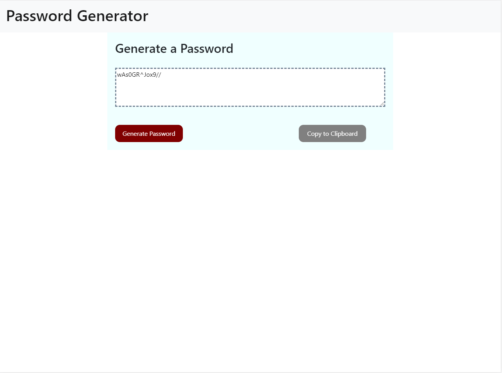

# pswgen
Secure random password generator

## Description

This application generates a random password based on user-selected criteria.

The user will be prompted to choose from the following password criteria:

* Length (must be between 8 and 128 characters)

* Character type:

  * Special characters 

  * Numeric characters

  * Lowercase characters

  * Uppercase characters

The application validates user input and ensures that at least one character type is selected.

Once all prompts are answered, the user will be presented with a password matching the answered prompts.

The user will also have the option to click a button to copy the password to their clipboard.

Try it at https://nunetang.github.io/pswgen/
